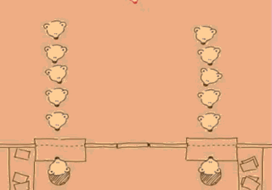

class: inverse, center, middle

# Purely Functional Real-time Queue
## CindyLinz

2016.2.4

---

## Purely functional data structures

--

  + Ephemeral data structures

--

  + Fully persistent data structures

--

  + Partially persistent data structures

--

  + Purely functional data structures

---

## Time Complexity

  + 一種衡量演算法執行效率的尺度

    只考慮輸入資料大小與執行時間長度之間的 **成長趨勢** 的度量方式

--

  + Worst case time complexity

--

  + Expected time complexity

--

  + Amortized time complexity

---

## Queue



出處 [https://www.reddit.com/r/gifs/comments/13ecrp/waiting_in_line/](https://www.reddit.com/r/gifs/comments/13ecrp/waiting_in_line/)

--

(這是我找到的一個三年前的 link, 好像是 repost, 但我也不知道原始版在哪 orz)

---

## class Queue

```haskell
class Queue q where
  new :: q a
  push :: a -> q a -> q a
  pop :: q a -> Maybe (a, q a)
```

---

## Amortized O(1) queue implementation

```haskell
data QueueAmortized a = QueueAmortized
  [a] -- enqueue buffer
  [a] -- dequeue buffer
  deriving Show
```

--

```haskell
instance Queue QueueAmortized where
  new :: QueueAmortized a
  new = QueueAmortized [] []

  push :: a -> QueueAmortized a -> QueueAmortized a
  push a (QueueAmortized fs bs) = QueueAmortized (a:fs) bs

  pop :: QueueAmortized a -> Maybe (a, QueueAmortized a)
  pop (QueueAmortized fs (b:bs)) = Just (b, QueueAmortized fs bs)
  pop (QueueAmortized [] []) = Nothing
  pop (QueueAmortized fs []) = Just (b, QueueAmortized [] bs) where
    b : bs = reverse fs
```

--

  + `push` O(1)
  + `pop` O(1) 或 O(|`fs`|), `fs` 中的每個元素都分別是之前的 O(1) 的 `push` 貢獻的

--

平常 `push` 的時候繳保險費, 遇到 O(|`fs`|) 的時候理賠吐出來. 繳的保費一定夠賠

---

## Amortized O(1) with fully persistent usage

```haskell
let
  myQueue = foldr push new [1..999999] :: QueueAmortized Int
  -- foldr :: (a -> b -> b) -> b -> [a] -> b
  -- myQueue = QueueAmortized [1..999999] []

  bads = map (\x -> pop (push x myQueue)) [1..55555]
  -- bads =
  --   [ Just (999999, QueueAmortized [] [999998..1,1])
  --   , Just (999999, QueueAmortized [] [999998..1,2])
  --   , Just (999999, QueueAmortized [] [999998..1,3])
  --   ...
  --   , Just (999999, QueueAmortized [] [999998..1,55555])
  --   ]
```

---

## 翻太急了, 改成一點一點慢慢翻..

```haskell
reverse :: [a] -> [a]
reverse as = go as [] where
  go [] done = done
  go (x:xs) done = go xs (x:done)
```

--

```haskell
Moving a = Reversing
  [a] -- 等待翻轉
  [a] -- 已被翻轉

moveMoving :: Moving a -> Moving a
moveMoving (Reversing [] bs) = Reversing [] bs
moveMoving (Reversing (a:as) bs) = Reversing as (a:bs)
```

從 `Reversing as []` 到 `Reversing [] bs` 共 `moveMoving` 了 `length as` 次

---

## 我們需要提早翻, 在 dequeue buffer 用完以前翻完

  + 我們作了一個

    把 `QueueAmortized as bs` 變成

    `QueueAmortized [] (bs ++ reverse as)` 的動作

    其中 `bs` 是「開始翻」的時候的 `bs`, `length bs > 0`

--

  + 需要考慮 `(++)`
    ```haskell
    (++) :: [a] -> [a] -> [a]
        [] ++ ys = ys
    (x:xs) ++ ys = x : (xs ++ ys)
    ```

    `bs ++ reverse as` 的 `(++)` 需要遞迴 `length bs` 次 `(x:xs)` 這個 pattern

---

## `(++)` 太懶了, 我們要催它動一動

```haskell
(++) :: [a] -> [a] -> [a]
    [] ++ ys = ys
(x:xs) ++ ys = x : (xs ++ ys) -- (:) x (xs ++ ys)
```

  + `(++)` 是 lazy 的運算, 沒有用到就不會算, 要取出第一個元素時也只增加一步的時間.

    -- 看起來很美好 --

--

  + 但如果 `(++)` 後剛好一直沒有取東西出來, 然後再疊了一個 `(++)`, 那麼之後取元素時要再多一步的時間.

    如果疊了 k 個 `(++)`, 那麼取元素就需要 k 步..

    -- 不可接受 --

--

  + 必須在疊下一個 `(++)` 以前把遞迴計算都跑完

    (或是保證疊的次數會在某個常數限制以內)

---

## `(++)` 太懶了, 我們要催它動一動

```haskell
data Moving a = Concating
  [a] -- list 脊椎
  [a] -- 一步步推脊椎用的 handle

-- 從 Concating cs cs 開始
moveMoving (Concating cs []) = Concating cs []
moveMoving (Concating cs (h:hs)) = Concating cs hs
```

從 `Concating cs cs` 到 `Concating cs []` 共 `moveMoving` 了 `length cs` 次

不過不需要推光光, 只要把「前半部」推光就好了

---

## Realtime Queue data structure

```haskell
data Moving a
  = Reversing
    [a] -- 等待翻轉
    [a] -- 已被翻轉
    [a] -- 翻完以後要接的頭部
  | Concating
    [a] -- list 脊椎
    [a] -- 一步步推脊椎用的 handle
  deriving Show

-- 搬動一步
moveMoving :: Moving a -> Moving a
moveMoving (Reversing (a:as) bs hs) = Reversing as (a:bs) hs
moveMoving (Reversing [] bs hs) = moveMoving (Concating cs cs) where
  cs = hs ++ bs
moveMoving (Concating cs (h:hs)) = Concating cs hs
moveMoving (Concating cs []) = Concating cs []

-- dequeue 出一項
dequeueMoving :: Moving a -> (a, Moving a)
dequeueMoving (Reversing as bs (h:hs)) = (h, Reversing as bs hs)
dequeueMoving (Reversing [] (b:bs) []) = (b, Reversing [] bs [])
dequeueMoving (Concating (c:cs) hs) = (c, Concating cs hs)
```

---

## 計算發動的時機點

  + 情境假設:

      - 一個 queue 當下沒有「搬到一半」的東西
      - enqueue buffer 為 `as`
      - dequeue buffer 為 `bs`

--

  + 計算量的部分:

    先作 `reverse` 然後再作 `(++)`

    `reverse` 需要 `moveMoving` `length as` 次

    `(++)` 需要 `moveMoving` `length bs` 次

--

  + 期限的部分:

    `bs` 被吃完以前 `reverse` 的部分必須完成

    再次發動翻面以前 `reverse` 與 `(++)` 都必須完成

---

## 計算發動的時機點

  + 先作 `reverse` 然後再作 `(++)`

    `reverse` 需要 `moveMoving` `length as` 次

    `(++)` 需要 `moveMoving` `length bs` 次

  + `bs` 被吃完以前 `reverse` 的部分必須完成

    再次發動翻面以前 `reverse` 與 `(++)` 都必須完成

  + 我選 `length as == length bs + 1` 的時候開始翻面, 並且同時先翻第一步~

    (平時 `length as <= length bs`)

--

  + `push` 的影響: `as` 長度 +1, 距離發動翻面靠近一步

    `pop` 的影響: `bs` 的長度 -1, 距離發動翻面靠近一步 &amp; `bs` 被吃完也靠近一步

--

  + `push` 與 `pop` 時各 `moveMoving` 一次 (還有開始翻面的的時候 `moveMoving` 一次)

---

## 計算發動的時機點

  + 我選 `length as == length bs + 1` 的時候開始翻面, 並且同時先翻第一步~

    (平時 `length as <= length bs`)

  + `push` 的影響: `as` 長度 +1, 距離發動翻面靠近一步

    `pop` 的影響: `bs` 的長度 -1, 距離發動翻面靠近一步 &amp; `bs` 被吃完也靠近一步

  + `push` 與 `pop` 時各 `moveMoving` 一次 (還有開始翻面的的時候 `moveMoving` 一次)

  + 這個開始翻面的時間點不需要太精準

    而 `push` `pop` 的時候也可以各 `moveMoving` k 次, 只要這個 k 是一個常數或某個選定的常數以下即可

    開始翻面的時候, 之前翻面的動作也不一定需要完成, 只要「疊」的數量是在某個常數 s 以下即可

    `bs` 被吃完的時候 `reverse` 不一定要完全完成, 只剩下常數限制內的步數也可以

---

## Realtime Queue

```haskell
data QueueRealtime a = QueueRealtime
  Int -- enqueue buffer length
  Int -- dequeue buffer length
  [a] -- enqueue buffer
  (Moving a) -- dequeue buffer (possibly in progress)
  deriving Show

-- 開始一個搬動流程
startMoving :: [a] -> Moving a -> Moving a
startMoving as (Concating bs _) = moveMoving (Reversing as [] bs)

instance Queue QueueRealtime where
  new :: QueueRealtime a
  new = QueueRealtime 0 0 [] (Concating [] [])
```

---

## Realtime Queue

```haskell
data QueueRealtime a = QueueRealtime
  Int -- enqueue buffer length
  Int -- dequeue buffer length
  [a] -- enqueue buffer
  (Moving a) -- dequeue buffer (possibly in progress)

instance Queue QueueRealtime where
  push :: a -> QueueRealtime a -> QueueRealtime a
  push a (QueueRealtime enN deN enBuffer deBuffer)
    | enN == deN =
      QueueRealtime 0 (deN + enN + 1) [] $! startMoving enBuffer' deBuffer
    | otherwise =
      QueueRealtime (enN + 1) deN enBuffer' $! moveMoving deBuffer
    where
      enBuffer' = a : enBuffer

  pop :: QueueRealtime a -> Maybe (a, QueueRealtime a)
  pop (QueueRealtime enN deN enBuffer deBuffer)
    | deN == 0 =
      Nothing
    | enN == deN =
      let !as' = startMoving enBuffer as
      in Just (a, QueueRealtime 0 (deN + enN - 1) [] as')
    | otherwise =
      let !as' = moveMoving as
      in Just (a, QueueRealtime enN (deN - 1) enBuffer as')
    where
      (a, as) = dequeueMoving deBuffer
```

---

## 總結

  + 如果一個資料結構或演算法是 amortized 的, 它的時間證明中用來付保費的地方就是可以 schedule 預支小量計算的地方

--

  + 把理賠金提早預支有可能增加原本不用考慮的計算 (像是本例中的 `(++)`), 不過它也都會是 amortized, 可以用類似方式預支..

    (至於這個預支有沒再增加額外計算, 再增加額外計算... 是不是保證收斂我就不確定了)

--

  + 有些資料結構, amortized 比 realtime 簡單很多

    (例如說 binary search tree 裡面 splay tree 對比 RB tree 或 AVL tree 或 2-3-4 tree)

    可以先設計成 amortized 版本, 再用 schedule 逐步改成 realtime 版本.

---

## 參考資料

  + [Purely Functional Data Structures](https://www.cs.cmu.edu/~rwh/theses/okasaki.pdf) by Chris Okasaki.

  + [這次的完整範例程式](https://github.com/CindyLinz/Talk-PureFunctionalRealTimeQueue/PureFunctionalRealtimeQueue)
